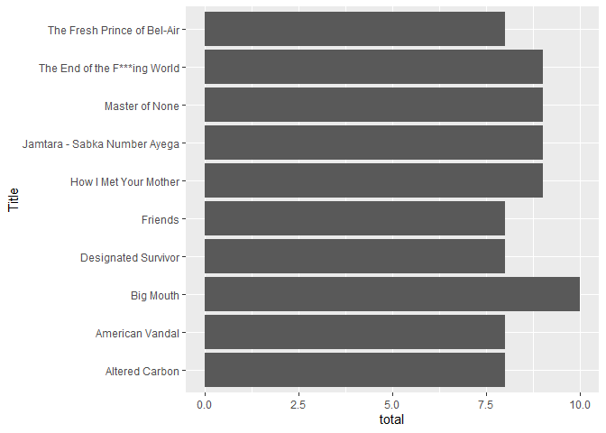
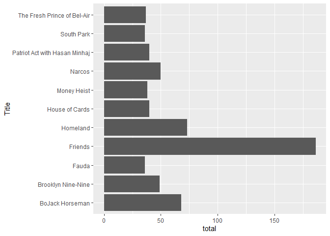
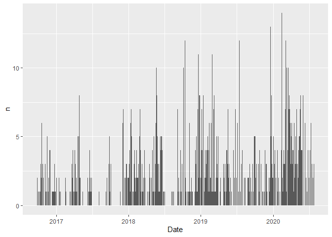
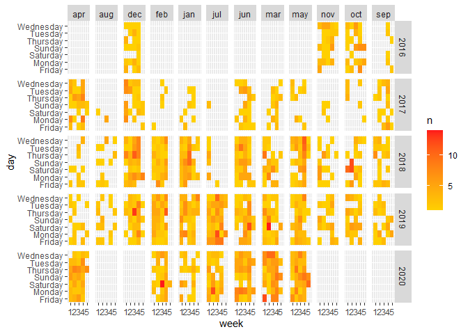
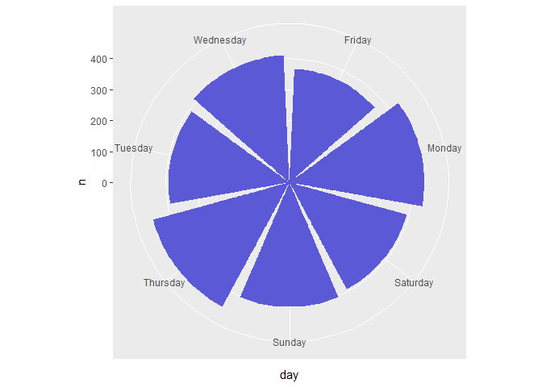
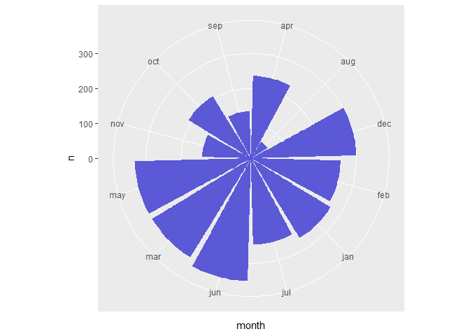

Netflix\_analysis
================

``` r
library(dplyr)
library(tidyr)
```

``` r
netflix<- read.csv("~/Desktop/NetflixViewingHistory.csv")
dim(netflix)
```

    ## [1] 2857    2

Selecting only the titles and not the episodes.

``` r
netflix<-netflix%>%separate(Title,c("Title","col1","col2"),sep=":")
netflix$col1<-NULL
netflix$col2<-NULL
binge<-netflix%>%select(Title,Date)%>%group_by(Title,Date)%>%summarise(total=n())%>%arrange(desc(total))
binge<-as.data.frame(binge)
```

Shows binged:

``` r
head(binge)
```

    ##                          Title       Date total
    ## 1                    Big Mouth 06/10/2018    10
    ## 2        How I Met Your Mother 15/07/2019     9
    ## 3 Jamtara - Sabka Number Ayega 15/02/2020     9
    ## 4               Master of None 21/01/2018     9
    ## 5 The End of the F***ing World 19/12/2019     9
    ## 6               Altered Carbon 01/03/2018     8

According to sources a binge is when you watch 2-6 episodes in one
sitting, so for this analysis I will take 6 episodes.

``` r
binge<-subset(binge,total>=6)
library(ggplot2)
binge<-binge%>%top_n(10)
ggplot(binge,aes(total,Title))+geom_bar(stat = "identity")
```

<!-- -->

So the most binged show was “big mouth” dated on 6/10/2018.

``` r
view<-netflix%>%select(Title,Date)%>%group_by(Title)%>%summarise(total=n())%>%arrange(desc(total))
view<-as.data.frame(view)
view<-view%>%top_n(10)
ggplot(view,aes(total,Title))+geom_bar(stat = "identity")
```

<!-- -->

most viewed show is “Friends”.^

time analysis of netflix data:

``` r
library(lubridate)

netflix$Date<-dmy(netflix$Date)
netflix$day<-weekdays(netflix$Date)
day_analysis<-netflix%>%count(Date)%>%arrange(desc(n))
head(day_analysis)
```

    ##         Date  n
    ## 1 2019-03-09 14
    ## 2 2020-02-15 14
    ## 3 2019-12-19 13
    ## 4 2018-10-13 12
    ## 5 2018-10-14 12
    ## 6 2019-06-22 12

2019-03-09 14 and 2020-02-15 14 :the two days where i binged the most
shows and movies.

``` r
ggplot(day_analysis,aes(Date,n))+geom_bar(stat = "identity")
```

<!-- -->

we see that the amount of netflix shows/movies consumed has increased
over the years.^

daily consumption through all the years:

``` r
day_analysis$year<-year(day_analysis$Date)
day_analysis$month<-month(day_analysis$Date)
day_analysis$day<-weekdays(day_analysis$Date)
day_analysis$week<-ceiling(day(day_analysis$Date)/7)
a<-day_analysis$month
day_analysis$month<-ifelse(a==1,"jan",ifelse(a==2,"feb",ifelse(a==3,"mar",ifelse(a==4,"apr",ifelse(a==5,"may",ifelse(a==6,"jun",ifelse(a==7,"jul",ifelse(a==8,"aug",ifelse(a==9,"sep",ifelse(a==10,"oct",ifelse(a==11,"nov","dec")))))))))))

ggplot(day_analysis,aes(week,day))+geom_tile(aes(fill=n))+facet_grid(year~month)+scale_fill_gradient(low = "#FFD000", high = "#FF1919")
```

<!-- -->

which day of the week is my consumption the highest:

``` r
ggplot(day_analysis,aes(day,n))+coord_polar()+ geom_col(fill = "#5b59d6")
```

<!-- -->

thursdays is the most^

which month of the year is my consumption the highest

``` r
ggplot(day_analysis,aes(month,n))+coord_polar()+ geom_col(fill = "#5b59d6")
```

<!-- -->

june is the highest^

which month of all the years is my consumption the highest

``` r
day_analysis$month_year<-paste(day_analysis$month,day_analysis$year,sep = " ")
ggplot(day_analysis,aes(month_year,n))+coord_polar()+ geom_col(fill = "#5b59d6")
```

<!-- -->

march 2020 is the highest^

2020 comparision with other years(from 2017) consisdering only the first
6 months:

``` r
day_analysis<-subset(day_analysis,year!=2016)
day_analysis$m<-month(day_analysis$Date)
day_analysis<-subset(day_analysis,m<=6)

ggplot(day_analysis,aes(n,month))+geom_bar(stat = "identity")+facet_grid(~year)
```

<!-- -->

we see that their is very high consumption in the year 2020 compared to
the other years. one of the reasons could be the spread of the COVID-19
virus which has forced people to stay at home and with a lot of time in
our hands , the consumption of netflix has dramatically increased.
